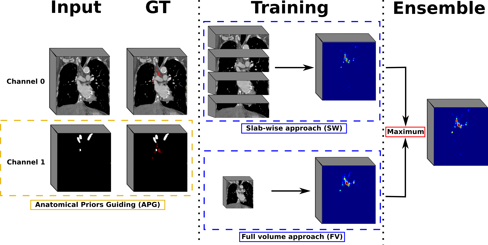

# Mediastinal lymph nodes segmentation using 3D convolutional neural network ensembles and anatomical priors guiding
- - -

The repository contains the architectures, inference code,
and trained models for lymph nodes segmentation in contrast-enhanced CT volumes.

## Description
The following models are provided, all trained on one fold of our 5-fold cross-validation (i.e., 72 patients):  
* CT_Lungs: Model trained using a simple 3D U-Net architecture, using the entire input volume.  
* UNet-SW32: Model trained using a simple 3D U-Net architecture, on slabs of 32 slices.  
* AGUNet: Model trained using the 3D Attention-Gated U-Net architecture, using the entire input volume.
* AGUNet-APG: Model trained using the 3D Attention-Gated U-Net architecture, using the entire input volume,
  and a mask with anatomical priors (esophagus, azygos vein, subclavian artieries and brachiocephalic veins).  
  :warning: the mask must be fed manually by the user, a trained model is not provided for this. 

## Citing
Please cite the following article if you re-use any part of the code, the trained models, or suggested ground truth files:
>'@article{bouget2021mediastinal,  
  title={Mediastinal lymph nodes segmentation using 3D convolutional neural network ensembles and anatomical priors guiding},  
  author={Bouget, David and Pedersen, Andre and Vanel, Johanna and Leira, Haakon O and Langø, Thomas},  
  journal={arXiv preprint arXiv:2102.06515},  
  year={2021}  
}'

## Stand-alone data and annotation access
The annotations for the benchmark subset have been proofed by an expert radiologist.
For the NIH dataset, the annotations were performed by a medical trainee under supervision of the expert.  
**Benchmark subset:** Fifteen contrast-enhanced CT volumes from St. Olavs University Hospital patients.
Stations and segmentations for all lymph nodes are provided, in addition to the segmentation for the esophagus,
azygos vein, subclavian arteries, and brachiocephalic veins.
Available for direct download [here](https://drive.google.com/uc?id=1ZsFq7PslqQ5ow_dXB01kDkaKPqYDXD5d).  
**NIH dataset**: Stations and refined segmentations for all lymph nodes in 89 patients from the open-source NIH dataset, available [here](https://drive.google.com/uc?id=1iVCnZc1GHwtx9scyAXdANqz2HdQArTHn).    
The CT volumes are available for download on the official [web-page](https://wiki.cancerimagingarchive.net/display/Public/CT+Lymph+Nodes).

**Mediastinal CT dataset**: The dataset described in our previous article is available for download [here](https://drive.google.com/uc?id=1YqCRcBpsFoE4JsBq5NROqIpeijnITpe1).
>'@article{bouget2019semantic,  
  title={Semantic segmentation and detection of mediastinal lymph nodes and anatomical structures in CT data for lung cancer staging},  
  author={Bouget, David and Jørgensen, Arve and Kiss, Gabriel and Leira, Haakon Olav and Langø, Thomas},  
  journal={International journal of computer assisted radiology and surgery},  
  volume={14},  
  number={6},  
  pages={977--986},  
  year={2019},  
  publisher={Springer}  
}'

## Installation
The following steps have been tested on both Ubuntu and Windows. The details below are for Linux. See the troubleshooting section below for Windows-specific details. 
### a. Python
The Python virtual environment can be setup using the following commands:  

> `virtualenv -p python3 venv`  
`source venv/bin/activate`  
`pip install -r requirements.txt`

### b. Docker  
Simply download the corresponding Docker image:  

> `docker pull dbouget/ct_mediastinal_structures_segmentation:v1`

### c. Models
In order to download the models locally and prepare the folders, simply run the following:   

> `source venv/bin/activate`  
`python setup.py`  
`deactivate`

## Usage
### a. Command line parameters
The command line input parameters are the following:
- i [Input]: Path to the MRI volume file, preferably in nifti format. Other formats will
  be converted to nifti before being processed, using SimpleITK.  
- o [Output]: Path and prefix for the predictions file. The base name must already exist
  on disk.
- m [Model]: Name of the model to use for inference, in the list [UNet-SW32, AGUNet, AGUNet-APG].
  To run ensembles, provide a coma-separated list of model names.  
- g [GPU]: (Optionnal )Id of the GPU to use for inference. The CPU is used if no eligible number is provided.
- l [Lungs]: (Optionnal) Path to a pre-generated lungs mask, with the same parameters as the main CT volume
  (i.e., dimensions, spacings, origin). If none is provided the mask will be generated.  
- a [APG]: (Optionnal) Path to a pre-generated mask containing the anatomical priors for guiding, with the same
  parameters as the main CT volume (i.e., dimensions, spacings, origin). If none is provided the mask will be set to 0.  

### b. Extra-configuration parameters
A runtime configuration file also exists in resources/data/runtime_config.ini,
where additional variables can be modified:  
- non_overlapping: [true, false], only in effect for the UNet-SW32 model. 
  True indicates no overlapping in predictions while false indicates stride 1 overlap.
- reconstruction_method: [thresholding, probabilities]. In the latter, raw prediction maps
  in range [0, 1] are dumped while in the former a binary mask is dumped using a pre-set
  probability threshold value.
- reconstruction_order: [resample_first, resample_second]. In the former, the raw probability map
  is resampled to the original patient's space before the reconstruction happens (slower) while
  in the former the opposite is performed (faster).  
- probability_threshold: threshold value to be used when the reconstruction method is set to thresholding
  (optimal values for each model can be found in the paper).
  
### c. Python execution
To run inference with the attention-gated U-Net model, using GPU 0, execute the following in the project root directory:  
> `source venv/bin/activate`  
`python main.py -i /path/to/file.nii.gz -o /output/path/to/output_prefix -m AGUNet -g 0`  
`deactivate`

### d. Docker execution
The local resources sub-folder is mapped to the resources sub-folder within the docker container.
As such, input CT volumes have to be copied inside resources/data to be processed and the output folder
for the predictions has to be set within the resources sub-folder to be accessible locally.  
:warning: The docker container does not have gpu support so all inferences are performed on CPU only.

> `cp /path/to/ct.nii.gz /path/to/ct_mediastinal_structures_segmentation/resources/data/ct.nii.gz`    
`docker run --entrypoint /bin/bash -v /path/to/ct_mediastinal_structures/resources:/home/ubuntu/resources -t -i dbouget/ct_mediastinal_structures_segmentation:v1`   
`python3 main.py -i ./resources/data/ct.nii.gz -o ./resources/output_prefix -m AGUNet`  

## Acknowledgements
Parts of the models' architectures were collected from the following repositories:  
- https://github.com/niecongchong/DANet-keras/  
- https://github.com/ozan-oktay/Attention-Gated-Networks  

For more detailed information about attention mechanisms, please read the corresponding publications:

>`@inproceedings{fu2019dual,`  
  `title={Dual attention network for scene segmentation},`  
  `author={Fu, Jun and Liu, Jing and Tian, Haijie and Li, Yong and Bao, Yongjun and Fang, Zhiwei and Lu, Hanqing},`    
  `booktitle={Proceedings of the IEEE Conference on Computer Vision and Pattern Recognition},`  
  `pages={3146--3154},`  
  `year={2019}`  
`}`

>`@article{oktay2018attention,`  
  `title={Attention u-net: Learning where to look for the pancreas},`  
  `author={Oktay, Ozan and Schlemper, Jo and Folgoc, Loic Le and Lee, Matthew and Heinrich, Mattias and Misawa, Kazunari and Mori, Kensaku and McDonagh, Steven and Hammerla, Nils Y and Kainz, Bernhard and others},`  
  `journal={arXiv preprint arXiv:1804.03999},`  
  `year={2018}`  
`}`

## Troubleshooting
On windows, to activate the virtual environment, run:
> `.\venv\Scripts\activate`

This assumes that one is using [virtualenv](https://pypi.org/project/virtualenv/) to make virtual environments. This can be easily installed using pip by:
> `pip install virtualenv`